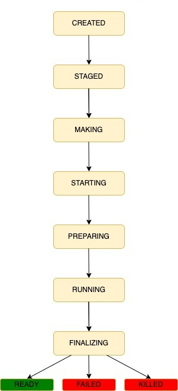

## Lifecycle of a Bundle

 

There are three different bundle types: `run` bundles, `uploaded` bundles and `make`
bundles. Each bundle type will enter various states while it is being processed.
Below are the various bundle state definitions by bundle type:

 

### Run Bundles

| State | State Description |
| - | - |
| **created** | Bundle has been created but its contents have not been populated yet. |
| **staged** | Bundle’s dependencies are all ready. Just waiting for workers to do their job. |
| **starting** | Bundle has been assigned to a worker and waiting for worker to start the bundle. |
| **preparing** | Waiting for worker to download dependencies and container image to run the bundle. |
| **running** | Bundle command is being executed in a container. Results are uploading. |
| **finalizing** | Bundle command has finished executing, deleting from worker. |
| **ready** | Bundle command is finished executing successfully, and results have been uploaded to the server. |
| **failed** | Bundle has failed. |
| **killed** | Bundle was killed by the user, and results have been uploaded to the server. |
| **worker_offline** | The worker where the bundle is running on is offline. |

 

### Uploaded Bundles

| State | State Description |
| - | - |
| **created** | Bundle has been created but its contents have not been uploaded yet. |
| **uploading** | Bundle contents are being uploaded. |
| **ready** | Bundle has completed uploading. |
| **failed** | Bundle has failed. |

 

### Make Bundles

| State  | State Description |
| - | - |
| **created** | Bundle has been created but its contents have not been populated yet. |
| **making** | Bundle contents are being populated by copying its dependencies. |
| **ready** | Bundle contents have been populated. |
| **failed** | Bundle has failed. |
