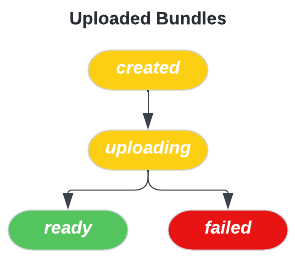
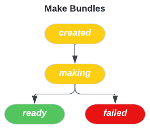
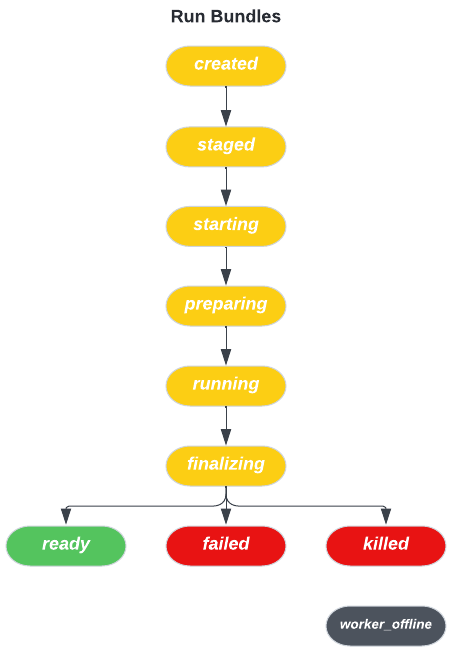

## Lifecycle of a Bundle

 

There are three types of bundles: `uploaded` bundles, `make` bundles and `run`
bundles. Each bundle transitions through various states during its lifecycle.

 

 

| State | State Description |
| - | - |
| **created** | Bundle has been created but its contents have not been uploaded yet. |
| **uploading** | Bundle contents are being uploaded. |
| **ready** | Bundle has completed uploading. |
| **failed** | Bundle has failed. |

 
 

 

| State  | State Description |
| - | - |
| **created** | Bundle has been created but its contents have not yet been populated. |
| **making** | Bundle contents are being populated by copying its dependencies. |
| **ready** | Bundle contents have been populated. |
| **failed** | Bundle has failed. |

 
 

 

| State | State Description |
| - | - |
| **created** | Bundle has been created but its contents have not been populated yet. |
| **staged** | Bundle’s dependencies are all ready. Waiting for the bundle to be assigned to a worker to be run. |
| **starting** | Bundle has been assigned to a worker and waiting for worker to start the bundle. |
| **preparing** | Waiting for worker to download bundle dependencies and Docker image to run the bundle. |
| **running** | Bundle command is being executed in a Docker container or results are being uploaded. |
| **finalizing** | Bundle command has finished executing, cleaning up on the worker. |
| **ready** | Bundle command is finished executing successfully, and results have been uploaded to the server. |
| **failed** | Bundle has failed. |
| **killed** | Bundle was killed by the user. Bundle contents populated based on when the bundle was killed. |
| **worker_offline** | The worker where the bundle is running on is offline, and the worker might or might not come back online. |
