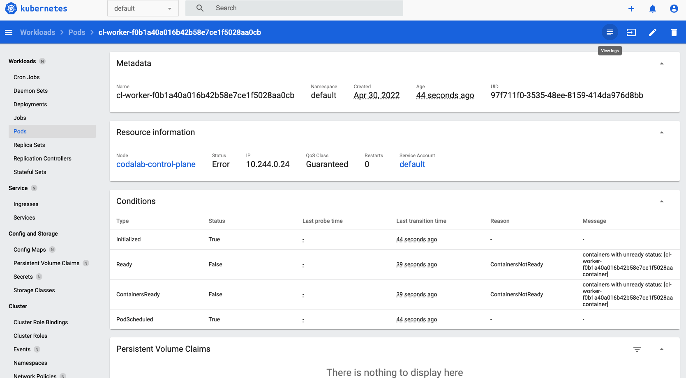

## Start a local Kubernetes Batch Worker Manager (with kind, for testing / development only)

If you want to test or develop with kubernetes locally, follow these steps to do so:

### Initial (one-time) setup

```
# First, start codalab without a worker:
codalab-service start -bds default no-worker

# Start minikube
minikube start

# Set up local kind cluster.
./scripts/local-k8s/setup.sh
# Set up web dashboard.
minikube dashboard
```

If all is successful, you should be able to log into your dashboard. You should have one node running (codalab-control-plane). After you follow the steps below, you should also be able to view each pod (which corresponds to each worker) and then check their logs by clicking on the icon in the top-right.



### Build worker docker image

You should repeat this step each time you change the worker docker image and want the local kind cluster to load it:

```bash
codalab-service build -s worker && minikube image load codalab/worker:k8s_runtime # replace k8s-runtime with your branch name (replace - with _)
```

### Run codalab and worker managers

Run:

```
export CODALAB_SERVER=http://nginx
export CODALAB_WORKER_MANAGER_CPU_KUBERNETES_CLUSTER_HOST=https://codalab-control-plane:6443
export CODALAB_WORKER_MANAGER_TYPE=kubernetes
export CODALAB_WORKER_MANAGER_CPU_KUBERNETES_CERT_PATH=/dev/null
export CODALAB_WORKER_MANAGER_CPU_KUBERNETES_AUTH_TOKEN=/dev/null
export CODALAB_WORKER_MANAGER_CPU_DEFAULT_CPUS=1
export CODALAB_WORKER_MANAGER_CPU_DEFAULT_MEMORY_MB=100
export CODALAB_WORKER_MANAGER_MIN_CPU_WORKERS=0
export CODALAB_WORKER_MANAGER_MAX_CPU_WORKERS=1
codalab-service start -ds default no-worker worker-manager-cpu
```

Or if you just want to run the worker manager and check its logs, run:
```
codalab-service start -bds worker-manager-cpu && docker logs codalab_kubernetes-worker-manager-cpu_1 --follow
```

### Teardown

You can remove the kind cluster by running:

```
kind delete cluster --name codalab
```
