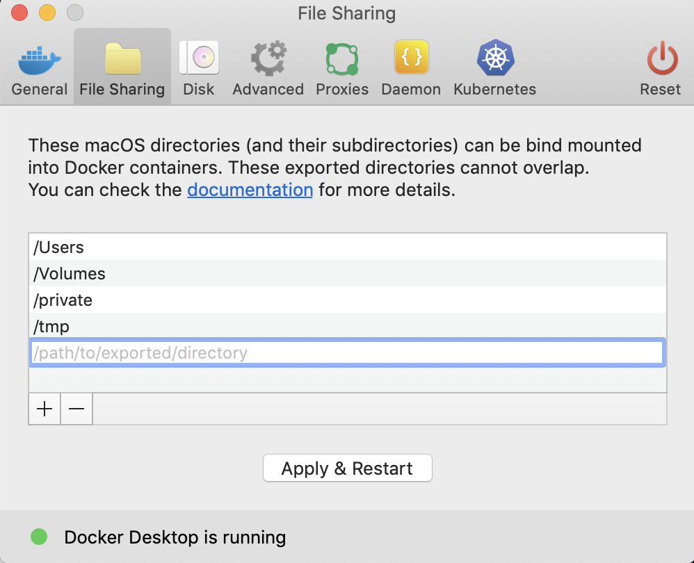

It's easy to run your own instance of CodaLab Worksheets!
You may want to do this if you'd like to use CodaLab locally on your laptop or
on your organization's own compute cluster, or if you want to develop and test
CodaLab features.

# Requirements

All you need is a version of Docker and docker-compose compatible with docker-compose file version 3.5.
Note that while Docker/docker-compose should be cross-platform, we have only tested Ubuntu and MacOS.
If you try to use CodaLab on Windows and run into issues, feel free to let us know, but those platforms
are not officially supported at the moment.

* [docker](https://docs.docker.com/install/) version 17.12.0+
* [docker-compose](https://docs.docker.com/compose/install/) version 1.18.0+

Get the source code:

    git clone https://github.com/codalab/codalab-worksheets

# Running

If you're in a hurry, you can start the CodaLab service (frontend, backend, one
worker) with one command:

    ./codalab_service.py start

Make sure to run the command **without** sudo. Running the service start up script with sudo can cause initialization of the mysql database to fail. See [Troubleshooting](#Troubleshooting) for how to resolve this.
You can then go to `http://localhost`, sign in with the root `codalab` user
(password `codalab`), try running some bundles.  Normally, you'd install the
CLI using `pip`, but to use the version of the CLI from the repo, you can run
it in Docker:

    docker exec codalab_rest-server_1 cl run date

That's it!

Note that a full deployment of CodaLab service consists of the
following Docker containers running the associated images, which you can see
by running `docker ps`:

Docker Container | Docker Image Used            | Purpose
-----------------|------------------------------|-------------------------------------------------
 frontend        | `codalab/frontend:<version>` | Website (serves static pages)
 rest-server     | `codalab/server:<version>`   | REST API endpoint (used by website and CLI)
 bundle-manager  | `codalab/server:<version>`   | Schedules bundles to workers in the background
 nginx           | `nginx:1.12.0`               | Routes requests to frontend or rest-server
 mysql           | `mysql/mysql:5.53`           | Database for users/bundles/worksheets
 worker          | `codalab/worker:<version>`   | Runs bundle in a Docker container

If you run `docker ps`, you should see a list of Docker containers like this
(by default, we have `--instance-name codalab`):

* `codalab_rest-server_1`
* `codalab_bundle-manager_1`
* `codalab_frontend_1`
* `codalab_mysql_1`
* `codalab_worker_1`
* `codalab_nginx_1`

There are two use cases going forward: (i) development (you're trying to modify
CodaLab) and (ii) productionization (you want to deploy this as a system that
people will use).  Each will build on this basic framework in a different way.

If you want to update CodaLab, run the following commands:

    git pull
    ./codalab_service.py pull
    ./codalab_service.py start

This will grab the latest Docker images, migrate the database, and start or
restart all the CodaLab services.  Any ongoing runs should not be affected.

# Protected Mode

Starting a CodaLab instance in protected mode will place the instance on lockdown. Anyone can 
still sign up for account, but only an admin can grant access to a user with an account. Users 
without granted access will be denied access to all REST endpoints, except a few basic 
account management endpoints.

In order to run an instance in protected mode, start the CodaLab service as follows:
    
    ./codalab_service.py start -p
    
As an admin, grant access to a user by running the following CLI command:

    cl uedit <username> --grant-access
    
Remove a user's access by running:

    cl uedit <username> --remove-access

# Development

If you're actively developing and want to test your changes, add the following two flags:

- `-b` (`--build-images`): builds the Docker images above based on your local
  code.  Otherwise, by default, the public images on
  [DockerHub](https://hub.docker.com/u/codalab) will be used.
- `-d` (`--dev`): runs the development version of the frontend so that your
  changes will be propagated instantly rather than having to rebuild any docker images.

Start the CodaLab service as follows:

    ./codalab_service.py start -bd

If you modify the frontend, you can do so without restarting.  If you would
like to modify the rest server, bundle manager, or worker, then you can edit
the code and then start only that single Docker container.  For example, for
the worker, the command would be:

    ./codalab_service.py start -bd -s worker

To stop all the Docker containers associated with the CodaLab service (but preserve all the data):

    ./codalab_service.py stop

If you want to delete all the data associated with this, then do:

    ./codalab_service.py delete

## Run two workers locally

Sometimes you may want to run two workers locally. In that case, you should run:

    ./codalab_service.py start -bds default worker2

## Azure Blob Storage

To start the server in dev mode with Azurite (an Azure Blob Storage emulator) enabled, run:

    codalab-service start -bds default azurite

To start the server in dev mode and use Azure Blob by default for all uploads, run:

    CODALAB_ALWAYS_USE_AZURE_BLOB_BETA=1 codalab-service start -bds default azurite

## Building Docker images

If you just want to build the Docker images without starting the CodaLab service:

    ./codalab_service.py build

We provide two default Docker images that bundles are run in if no Docker image
is specified, one for GPU jobs and one for non-GPU jobs:

- `codalab/default-cpu:<version>`
- `codalab/default-gpu:<version>`

If you would like to build these as well (note that this might take up to an
hour because lots of packages have to be installed):

    ./codalab_service.py build all

## Testing

Run test-setup.sh first to set up required files and directories.

    sh ./tests/test-setup.sh 

Since tests run against an existing instance, make sure you update your instance.

    ./codalab_service.py start -bd -s rest-server

To run the tests against an instance that you've already set up:

    python test_runner.py default

Or to run a specific test (e.g., basic):

    docker exec codalab_rest-server_1 python3 tests/cli/test_cli.py basic

In sum, to start an instance and run tests on it:

    sh ./tests/test-setup.sh
    ./codalab_service.py start -bd
    python test_runner.py default

These must pass before you submit a PR.

## Pre-commit

Before you commit, you should run the following script that makes automated
changes on your PR:

    ./pre-commit.sh

This script reformats your code to match our style conventions and
auto-generates documentation.

## Debugging

You can check the logs using standard Docker commands.  For example, if you want to know what the worker is doing:

    docker logs codalab_worker_1 --tail 100 -f

Or to see the logs of all the Docker containers:

    ./codalab_service.py logs --tail 100 -f

You can execute commands in the Docker images to see what's going on, for example:

    docker exec codalab_worker_1 ls /home/codalab/bundles

## Database migrations

Note: database migrations are run automatically when you start the CodaLab
services.

If you want to modify the database schema, use `alembic` to create a migration.  Note that everything must be run in Docker, but your modifications are outside in your local codebase.

1. Modify `codalab/model/tables.py` in your local codebase to the desired schema.

1. Rebuild the Docker image for the rest server and mysql:

        ./codalab_service.py start -bd -s rest-server mysql

1. Auto-generate the migration script. Running the following command generates a file named by a format similar to `2019091920_description_of_your_migration_1975ea83b712.py`. Note that when running `codalab_service.py` with `-d` option (dev mode), this script will be stored at a volume mounted into the Docker container in the `alembic` directory:

        docker exec codalab_rest-server_1 alembic revision --autogenerate -m "description of your migration"

1. Modify the migration script `2019091920_description_of_your_migration_1975ea83b712.py` as necessary.

1. Rebuild the Docker image:

        ./codalab_service.py start -bd -s rest-server

1. Apply the migration to change the actual database:

        docker exec codalab_rest-server_1 alembic upgrade head

1. Check that the migration was successful by looking at the database schema (use `desc <table>`):

        docker exec -ti codalab_mysql_1 bash
        mysql -u codalab -p codalab_bundles   # Type in `codalab` as the password

If you want to undo the previously done migration, you can run:

        docker exec codalab_rest-server_1 alembic downgrade -1

# Production

If you want to make the CodaLab instance more permanent and exposed to a larger
set of users, there are a couple details to pay attention to.

The preferred way to set CodaLab service options is via environment variables
instead of command-line options. This is useful for sensitive options like
passwords, and also useful for setting local defaults instead of reusing long
argument lists.  For the list of environment variables, look at
`codalab_service.py`.  Below, we provide the command-line variants.

## Security and Credentials

By default, a lot of credentials are set to unsafe defaults (`"codalab"`).  You
should override these with more secure options.  Here's a list of all
credential options:

* `--codalab-username`: Username of the admin account on the CodaLab platform
* `--codalab-password`: Password of the admin account on the CodaLab platform
* `--mysql-root-password`: Root password for the MYSQL database.
* `--mysql-username`: MYSQL username for the CodaLab account on the MYSQL database
* `--mysql-password`: MYSQL password for the CodaLab account on the MYSQL database

### SSL

By default the web interface is served over HTTP. If you have certificates for
your domain, you can serve over HTTPS as well. To do so:

1. Ensure you have the certificate and key files in a path accessible to the service.
2. Set the following options when starting the CodaLab service, so that the
   website will be served over Port 443 using SSL:

    * `--use-ssl`: If specified, use SSL
    * `--ssl-cert-file`: Path to the certificate file
    * `--ssl-key-file`: Path to the key file

## Multiple instances

If for some reason you need to start more than one instance of the CodaLab
service on the same machine, be careful about the following:

* Use the `--instance-name` option with all commands: The default name is
  `codalab` but you should give other instances distinct names and use that
  argument any time you want to interact with that instance.
* Avoid disk mount clashing: If you're using host machine disk mounts to store
  data, make sure mountpoints are different for different instances.
* Avoid port clashing: If you're exposing ports, make sure you set different
  ports for different instances, at the very least you need to configure the
  `http-port` of later instances to something other than `80`.

## Troubleshooting

If you run the codalab_service script with root privileges and see an error about either of the following:

    Unknown MySQL server host 'mysql' (0)
    Host '*.*.*.*' is not allowed to connect to this MySQL server

Make sure you can run docker commands without root privileges. If you cannot, make sure to run:

    sudo usermod -aG docker ${USER}

Exit the terminal window in which that command is run. Once you ensure docker commands can be run without sudo, Remove the `var` folder from within the `/codalab-worksheets` directory. **Warning: Removing the `var` folder leads to data loss for your local Codalab instance.** Backup any necessary data first.

For macOS, you might come across an error with `gunicorn` when running `./codalab_service.py start -bd`

The issue is documented in detail [here](https://github.com/benoitc/gunicorn/issues/1388), and the fix
is to unselect `/tmp` in Docker's preferences under file sharing.

The image below shows where the file sharing pane is.

## Sending Slack notifications from the monitor.py service
If you need to send Slack notifications from monitor.py service, you can configure your system by Slack Email App as follows:

* Go to [Slack Email App](https://slack.com/apps/A0F81496D-email) 
* Sign in to install and follow instructions listed on the above web page to generate your special Slack email address.
* Since the system notifications from monitor.py are sent to $CODALAB_ADMIN_EMAIL, you can set $CODALAB_ADMIN_EMAIL to your special 
   Slack email address which will show up in a designated Slack channel.
* Note that this integration only works with workspaces on *the Slack Standard Plan and above*.

