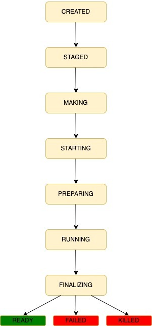

## Bundle State Diagram

 

 

## Bundle State Descriptions

| STATE | DESCRIPTION |
| - | - |
| **created** | Just created. |
| **staged** | All the dependencies are met. |
| **making** | Creating a make bundle. |
| **starting** | Wait for the worker to start running the bundle. |
| **preparing** | Wait for worker to download dependencies and docker images. |
| **running** | Actually running. |
| **finalizing** |  Run finished and finalized server-side, tell worker to discard it. |
| **ready** | Done running and succeeded. |
| **failed** | Done running and failed. |
| **killed** | Killed by user. |
