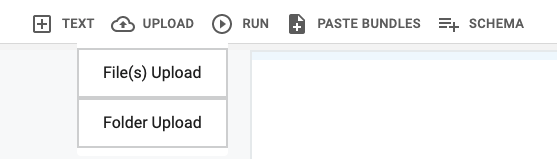
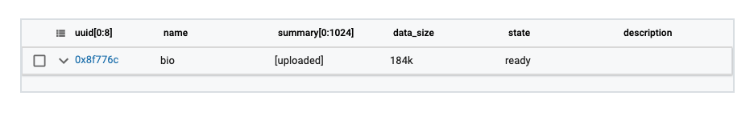

CodaLab is centered around the idea of **bundles**, which can store data. You can upload a file / folder to CodaLab to create a bundle, and then you can download the entire bundle or parts of the bundle.

In CodaLab, you can upload bundles to the bundle store. To do so, you can either use the `cl upload` command from the CLI or click on the "Upload" button from the worksheets interface.

## Basic guide

### Using the CLI

You can upload bundles from the CLI with the `cl upload` command.

Let's upload a folder from the CLI:

``` bash
% mkdir -p myfolder
% echo "hello world" > myfolder/one.md
% echo "goodbye world" > myfolder/two.md
% cl upload myfolder
Preparing upload archive...
Uploading myfolder.tar.gz (0xdc74e4ef29b64ab19e1e26e94ea22811) to https://worksheets-dev.codalab.org
Sent 0.01MiB [0.07MiB/sec]    
0xdc74e4ef29b64ab19e1e26e94ea22811
```

Now, one can also view the information of the uploaded bundle using the `cl info` command:

``` bash
% cl info 0xdc74e4ef29b64ab19e1e26e94ea22811
bundle_type               : dataset
uuid                      : 0xdc74e4ef29b64ab19e1e26e94ea22811
state                     : ready
command                   : <none>
frozen                    : <none>
is_anonymous              : False
owner                     : codalab(0)
name                      : myfolder
created                   : 2021-02-16 11:53:56
data_size                 : 4.0k
```

You can preview the bundle, or individual files in it, using `cl cat`:

``` bash
% cl cat 0xdc74e4ef29b64ab19e1e26e94ea22811
name    perm   size
-------------------
one.md  0o644    12
two.md  0o644    14
% cl cat 0xdc74e4ef29b64ab19e1e26e94ea22811/one.md
hello world
```

Finally, you can download the entire bundle, or individual files within it, using `cl download`:

``` bash
% cl download 0xdc74e4ef29b64ab19e1e26e94ea22811 -o output
Downloading myfolder(0xdc74e4ef29b64ab19e1e26e94ea22811)/ => .../output
Received 0.00MiB [0.05MiB/sec] 
% cl download 0xdc74e4ef29b64ab19e1e26e94ea22811/one.md -o output-one.md
Downloading myfolder(0xdc74e4ef29b64ab19e1e26e94ea22811)/one.md => .../output-one.md
Received 0.00MiB [0.00MiB/sec]
```

### Using the web interface

From the web interface, click on the "Upload" button to upload files or folders.



Once you select the file / folder to upload, it will be added to the worksheet:



You can click on the bundle to view more information or download it.

## The --link argument

When you pass the `--link` argument when running `cl upload`, this makes the file path the source of truth of the bundle, meaning that the server will retrieve the bundle directly from the specified path rather than storing its contents in its own bundle store. 

Here is an example of using the link functionality:

```bash
% cl upload /u/nlp/data/a.txt --link
```

In the above example, the upload command will be executed instantaneously (with no data transfer of the actual file), and the server will retrieve the data from the given link path when the bundle is required as a dependency. The bundle is thus a **linked bundle**.

Linked bundles are useful if, for example, the bundle is very large and the workers already have access to the original file through a shared filesystem, as it avoids having to upload the entire file to the bundle store.

You can tell if a bundle is a linked bundle by checking to see if the `link_url` metadata entry is set when running `cl info`:

``` bash
% cl info 0x3013b2c4519c4c99a622b07af078a5ff
bundle_type               : dataset
uuid                      : 0x3013b2c4519c4c99a622b07af078a5ff
state                     : ready
command                   : <none>
frozen                    : <none>
is_anonymous              : False
owner                     : codalab(0)
name                      : mkdocs.yml
created                   : 2021-02-16 12:03:38
link_url                  : /u/nlp/data/a.txt
link_format               : raw
```

You can still run the same commands on linked bundles (`cl download`, `cl cat`, etc.) as you do for normal bundles.
