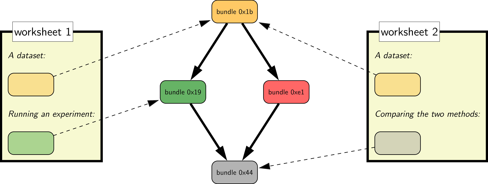

# CodaLab Worksheets

For an introduction to CodaLab, check out our two-minute overview:

To get started, clone the [examples](https://github.com/codalab/worksheets-examples) repository and walk
through the material there.  If you find bugs or have feature
requests, please file a [GitHub issue](https://github.com/codalab/codalab-worksheets/issues/new).

## **Why CodaLab Worksheets?**

While there has been tremendous progress in machine learning, data science,
natural language processing, computer vision, and many other data- and
computation-intensive fields, the research process is far from optimal.  Most
of the time, the output of research is simply a PDF file (published paper).
Even when people release their data and code (which is a big step forward), it
is often not obvious how to run it to obtain the results in a paper.  Simply
put:

> ***Today, researchers spend excruciating amounts of time reproducing published results.***

The goal of CodaLab Worksheets is to fix this in order to both accelerate the
rate of research and make it more sound.

## **How does CodaLab Worksheets work?**

> ***CodaLab keeps the full provenance of an experiment, from raw data to the
> final performance numbers that you put in your paper.***

There are two important concepts in CodaLab: ***bundles*** and ***worksheets***.

***Bundles*** are immutable files/directories that represent the code, data, and results of an experimental pipeline.  There are two ways to create bundles.  First, users can ***upload*** bundles, datasets in any format or programs in any programming language.
Second, users can create ***run bundles*** by executing
shell commands that *depend* on the contents of previous bundles.
A run bundle is specified by a set of bundle dependencies and an arbitrary shell command.
This shell command is executed in a [docker container](https://www.docker.com) in a directory
with the dependencies.  The contents of the run bundle are the files/directories which are
written to the current directory by the shell command:

Above, each rounded rectangle represents a bundle, and arrows represent
dependencies between bundles.  There are two bundles which are uploaded
by the user: the top left bundle is a single script `cnn.py` containing the
training code, and the top right bundle `mnist` contains the dataset.
Then there is a run bundle `exp2`, which depends on `cnn.py` and `mnist`.
CodaLab creates a [Docker](https://www.docker.com) container
and executes the shell command (bottom of box in green).
Running `exp2` produces new files `stdout`, `stderr`, and `stats.json`,
which form the contents of `exp2`.
In summary, the dependency graph over bundles precisely captures the research
process in an *immutable* way.

***Worksheets*** organize and present an experimental pipeline in a comprehensible
way, and can be used as a lab notebook, a tutorial, or an executable paper.
Worksheets contain references to bundles, and are written in a custom [markdown
language](Worksheet-Markdown.md).

Consider the following example:

At the center is the dependency graph over four
bundles. On the side are two separate worksheets, which contain
both text and pointers to various bundles.
Worksheet 1 might be Alice's research log where she is running experiments, while Worksheet
2 might be her collaborator Bob, who uses the same dataset (`0x1b`) and runs an analysis comparing
Alice's results (`0x19`) with someone else's results (`0xe1`).

CodaLab's philosophy is to give you full control of how you want to run your
experiments and get out of your way.  It just maintains the dependency
structure of your experiments and takes care of the actual execution.  A good
analogy is Git, which maintains the revision history
and gives you total freedom in terms of what to put in your repository.
